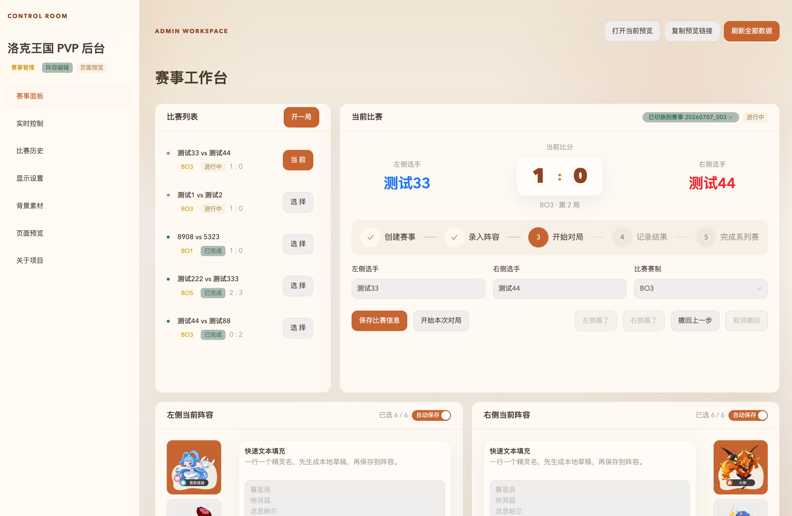
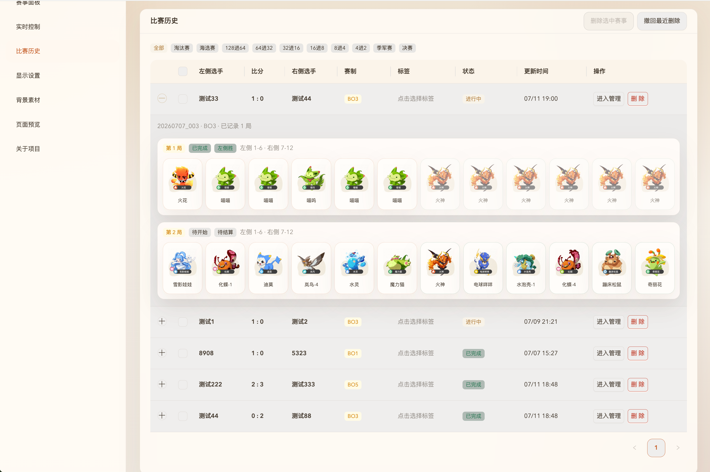
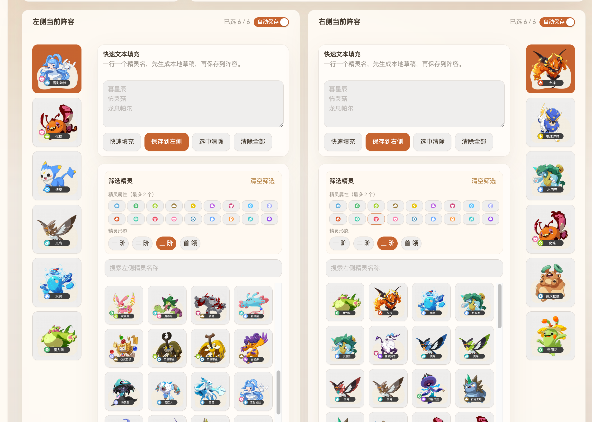
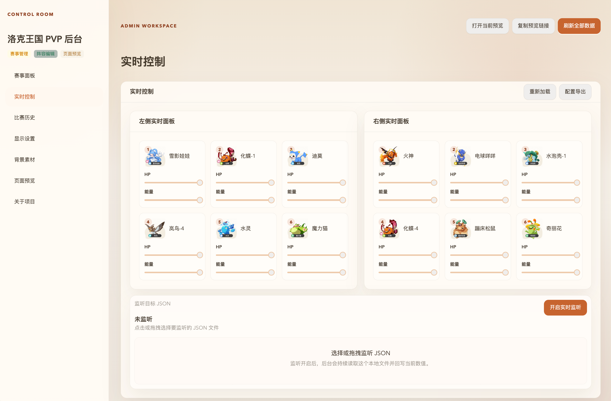
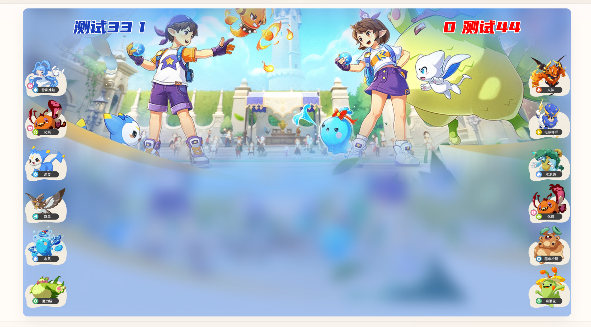
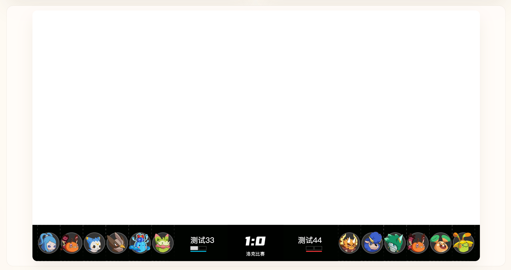
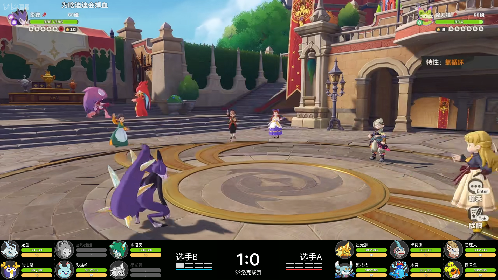
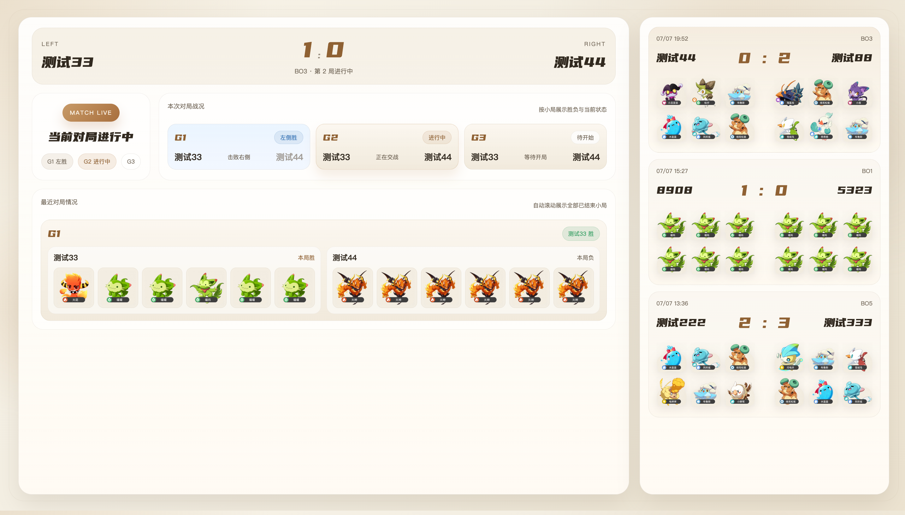
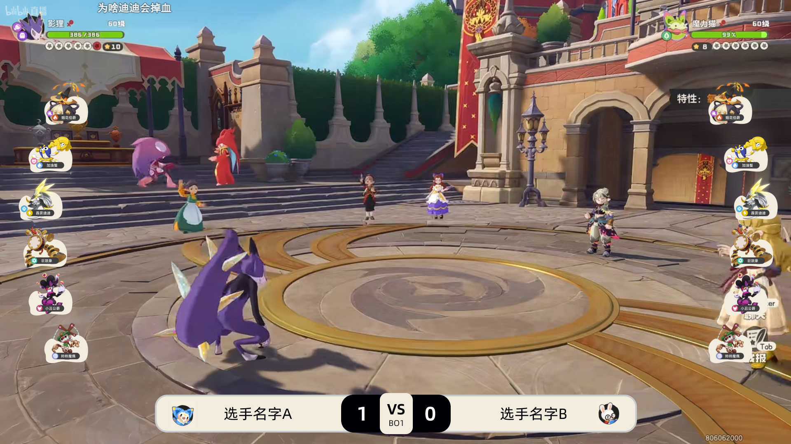

# pvp-webUI-for-roco

洛克王国 PVP 比赛推流控制台 —— Electron（Express + Socket.IO）+ React/Ant Design 管理后台，用于赛事录入、阵容同步、比分控制、素材管理与推流页面预览。

## 作者与许可

- 作者邮箱：463218006@qq.com
- 本软件**免费开源使用**，基于 [MIT License](./LICENSE) 发布，可自由使用、复制、修改与分发（分发时需保留版权声明与许可声明）。

## 界面截图

### 管理后台

### 推流页面

常用命令：

- `npm run build:electron`
- `npm run dev`
- `npm run package`

## 项目结构
pvp-webUI-for-roco/
├── electron/           # Electron 主进程
│   ├── services/       # 核心业务服务
│   ├── ipc/            # IPC 通信
│   ├── main.ts         # 应用入口
│   ├── server-entry.ts # 独立服务器入口
│   ├── socket-server.ts # HTTP + Socket.IO 服务器
│   └── preload.ts      # 预加载脚本
├── shared/             # 共享类型和常量
│   ├── types.ts        # TypeScript 类型定义
│   ├── events.ts       # Socket 事件常量
│   └── constants.ts    # 全局常量
├── src/
│   ├── admin-antd/     # 管理后台（Ant Design）
│   ├── login-antd/     # 登录页面（Ant Design）
│   ├── pages/          # HTML 页面模板
│   ├── scripts/        # 前端展示脚本
│   ├── styles/         # 前端样式
│   └── assets/         # 静态资源
└── resources/          # 游戏资源
    ├── sprites/        # 精灵图片
    ├── data/           # 数据文件
    └── attribute/      # 属性图标